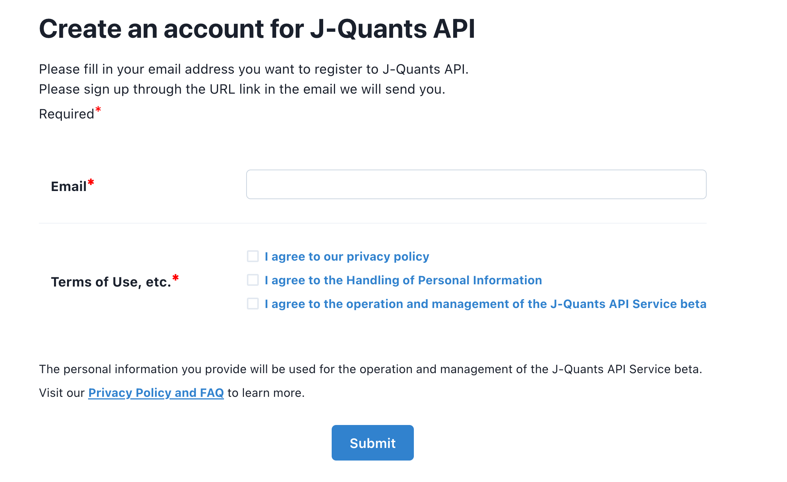
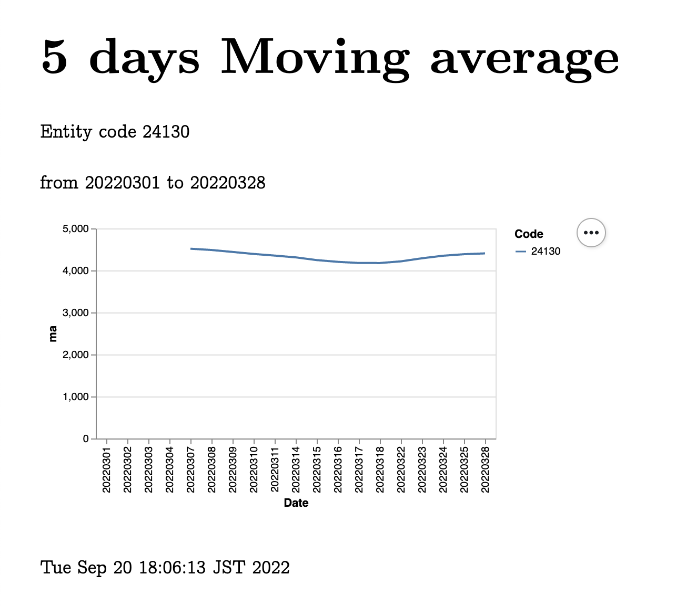

# hellonico/jquants-api-jvm

[](https://clojars.org/net.clojars.hellonico/jquants-api-jvm)

[](https://dl.circleci.com/status-badge/redirect/gh/hellonico/jquants-api-jvm/tree/master)


# Goal

jquants-api is a Clojure/JVM Wrapper around the [jquants api](https://jpx-jquants.com/).

The http based [jquants-api](https://jpx.gitbook.io/j-quants-api-en/api-reference/) propose a diverse set of daily financial data, like: 

- [Listed Issue](https://jpx.gitbook.io/j-quants-api-en/api-reference/listed-api) Information
- [Stock Price](https://jpx.gitbook.io/j-quants-api-en/api-reference/prices-api) Information
- [Market](https://jpx.gitbook.io/j-quants-api-en/api-reference/markets-api) Information

To use the jquants api, You first need to [register and create an account](https://application.jpx-jquants.com/register). 



Once you are registered, to setup your credentials for API access, you either need to:

- use the login function with your username and password, or
- create a login file as shown below:

```clojure
; In $HOME/.config/digima/login.edn
{:mailaddress "youremail@address.com" :password "yourpassword"}
```

Note that the login function simply outputs a file at the needed location.

__The jquants-api specifies a refresh token and an id token to get and refresh but this wrapper will refresh those tokens as needed without the user having to do anything.__

# Usage

For each function call, the returned data structure is according the jquants api, turned into Clojure data structures / maps with keywords as keys based on the json data.


```clojure
(daily {:code 86970 :date 20220118})

;; {:daily_quotes [{:AdjustmentVolume 498800.0
;;                  :TurnoverValue    1.2302805E9
;;                  :AdjustmentOpen   2482.0
;;                  :Low              2440.5
;;                  :AdjustmentClose  2465.0
;;                  :Volume           498800.0
;;                  :High             2489.0
;;                  :Date             "20220118"
;;                  :AdjustmentHigh   2489.0
;;                  :Code             "86970"
;;                  :Close            2465.0
;;                  :AdjustmentFactor 1.0
;;                  :AdjustmentLow    2440.5
;;                  :Open             2482.0}]}
```

```clojure
(statements {:code 869701 :date 20220727})

;; {:statements [{:ForecastDividendPerShareAnnual                                               "52.0"
;;                :ForecastOperatingProfit                                                      "65500000000"
;;                :ForecastDividendPerShare2ndQuarter                                           "26.0"
;;                :ForecastOrdinaryProfit                                                       "65500000000"
;;                :Profit                                                                       "12089000000"
;;                :TypeOfDocument                                                               "1QFinancialStatements_Consolidated_IFRS"
;;                :ResultDividendPerShareFiscalYearEnd                                          ""
;;                :DisclosedUnixTime                                                            "1658923200.0"
;;                :ChangesInAccountingEstimates                                                 "false"
;;                :DisclosureNumber                                                             "20220726504583"
;;                :ResultDividendPerShare3rdQuarter                                             ""
;;                :MaterialChangesInSubsidiaries                                                "false"
;;                :ApplyingOfSpecificAccountingOfTheQuarterlyFinancialStatements                ""
;;                :NumberOfTreasuryStockAtTheEndOfFiscalYear                                    "1938843"
;;                :EarningsPerShare                                                             "22.93"
;;                :OperatingProfit                                                              "17777000000"
;;                :NetSales                                                                     "33576000000"
;;                :LocalCode                                                                    "86970"
;;                :DisclosedDate                                                                "2022-07-27"
;;                :ResultDividendPerShare1stQuarter                                             "－"
;;                :Equity                                                                       "310098000000"
;;                :BookValuePerShare                                                            ""
;;                :CurrentPeriodEndDate                                                         "2022-06-30"
;;                :DisclosedTime                                                                "12:00:00"
;;                :ResultDividendPerShareAnnual                                                 ""
;;                :ChangesOtherThanOnesBasedOnRevisionsOfAccountingStandard                     "false"
;;                :OrdinaryProfit                                                               "17790000000"
;;                :RetrospectiveRestatement                                                     ""
;;                :ForecastProfit                                                               "45000000000"
;;                :EquityToAssetRatio                                                           "0.004"
;;                :AverageNumberOfShares                                                        "527204054"
;;                :CurrentFiscalYearEndDate                                                     "2023-03-31"
;;                :ForecastNetSales                                                             "132500000000"
;;                :TotalAssets                                                                  "76048180000000"
;;                :ResultDividendPerShare2ndQuarter                                             ""
;;                :ChangesBasedOnRevisionsOfAccountingStandard                                  "false"
;;                :CurrentFiscalYearStartDate                                                   "2022-04-01"
;;                :ForecastDividendPerShare1stQuarter                                           ""
;;                :ForecastEarningsPerShare                                                     "85.42"
;;                :ForecastDividendPerShareFiscalYearEnd                                        "26.0"
;;                :ForecastDividendPerShare3rdQuarter                                           "－"
;;                :NumberOfIssuedAndOutstandingSharesAtTheEndOfFiscalYearIncludingTreasuryStock "528578441"
;;                :TypeOfCurrentPeriod                                                          "1Q"}]}
```

```clojure
(listed-info {:code 10000})

;; {:info [{:Code               "86970"
;;          :UpdateDate         "20220927"
;;          :CompanyNameFull    "（株）日本取引所グループ"
;;          :MarketCode         "A"
;;          :CompanyName        "ＪＰＸ"
;;          :CompanyNameEnglish "Japan Exchange Group,Inc."
;;          :SectorCode         "7200"}]}
```


# Extra Code for the Wrapper

The wrapper can also create a local cache to get daily quotes based on fuzzy search for the name of the entity to get the quotes from.

Meaning, instead of :

```clojure
(daily {:Code 86970 :date 20220118})

;; {:daily_quotes [{:AdjustmentVolume 498800.0
;;                  :TurnoverValue    1.2302805E9
;;                  :AdjustmentOpen   2482.0
;;                  :Low              2440.5
;;                  :AdjustmentClose  2465.0
;;                  :Volume           498800.0
;;                  :High             2489.0
;;                  :Date             "20220118"
;;                  :AdjustmentHigh   2489.0
;;                  :Code             "86970"
;;                  :Close            2465.0
;;                  :AdjustmentFactor 1.0
;;                  :AdjustmentLow    2440.5
;;                  :Open             2482.0}]}
```

You can do:
```clojure
(daily-fuzzy {:CompanyNameEnglish "Japan Exchange" :date 20220118})

;; Same as above
;; {:daily_quotes [{:AdjustmentVolume 498800.0
;;                  :TurnoverValue    1.2302805E9
;;                  :AdjustmentOpen   2482.0
;;                  :Low              2440.5
;;                  :AdjustmentClose  2465.0
;;                  :Volume           498800.0
;;                  :High             2489.0
;;                  :Date             "20220118"
;;                  :AdjustmentHigh   2489.0
;;                  :Code             "86970"
;;                  :Close            2465.0
;;                  :AdjustmentFactor 1.0
;;                  :AdjustmentLow    2440.5
;;                  :Open             2482.0}]}
```

# Charting

There is a [charting example](./examples/charting-with-ox/src/hellonico/charting.clj) based on the [Ox](https://github.com/metasoarous/oz)

Which would open a browser window and show the following graph:



# Java Integration

This JQuants wrapper can also be called natively from Java code, with Maps as returned object from API calls.
Maps in Java can be accessed using query using [JXPath](https://commons.apache.org/proper/commons-jxpath/), as shown in the [java example](./examples/JavaSample/src/main/java/info/hellonico/jquantsapi/JQuantsApiSample.java) below:

```java
Map<?,?> result = api.daily("24130", "20220301");
JXPathContext context = JXPathContext.newContext(result);
Double open = (Double) context.getValue("/daily_quotes[1]/Open");
System.out.printf("Quote for %s on day %s is %f\n", code, date, open);

// Outputs:
// Quote for 24130 on day 20220301 is 4315.000000
```

Another example shows how to chart using [quickchart.io](https://quickchart.io/):

```java
String from = "20220301", to = "20220505";
Map<?,?> result = api.daily(code, from, to);
JXPathContext context = JXPathContext.newContext(result);

QuickChart chart = new QuickChart();
chart.setWidth(500);
chart.setHeight(300);
String config =
        format("{type: 'line',data: {labels: %s , datasets: [{label: 'Open', data:%s ,fill: false}, {label: 'Close', data:%s ,fill: false}]}}",
                context.selectNodes("//Date"),
                context.selectNodes("//Open"),
                context.selectNodes("//Close"));
chart.setConfig(config);

System.out.println(chart.getUrl());
```

Which outputs the following graph:


## License

Copyright © 2022 hellonico

Distributed under the Eclipse Public License version 1.0.
